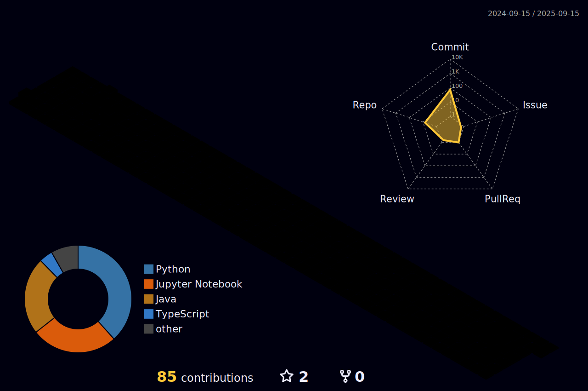

<h1 align="center">Hi, I'm Kelly Kimura</h1>

## Current Work
**Scientific Researcher** Applied Software Engineering Research Laboratory – LaPESA
Developing ML models (Scikit-Learn, Keras) to predict **Technical Debt** using classifiers (KNN, SVM, Random Forest).

## Professional Background
- **Scientific Research** - Word Embeending, KNN, Sentiment Analysis
- **Development** - JavaScript, TypeScript, PHP, SolidJS, Docker, MySQL
- **Tools** - Power BI, Python, R

## Currently Learning
- Exploratory Data Analysis & Data Science
- Analysis, Detection and Prediction of Technical Debt

 |  |  |  
 | ----------- | ----------- |

 
  

   

  

